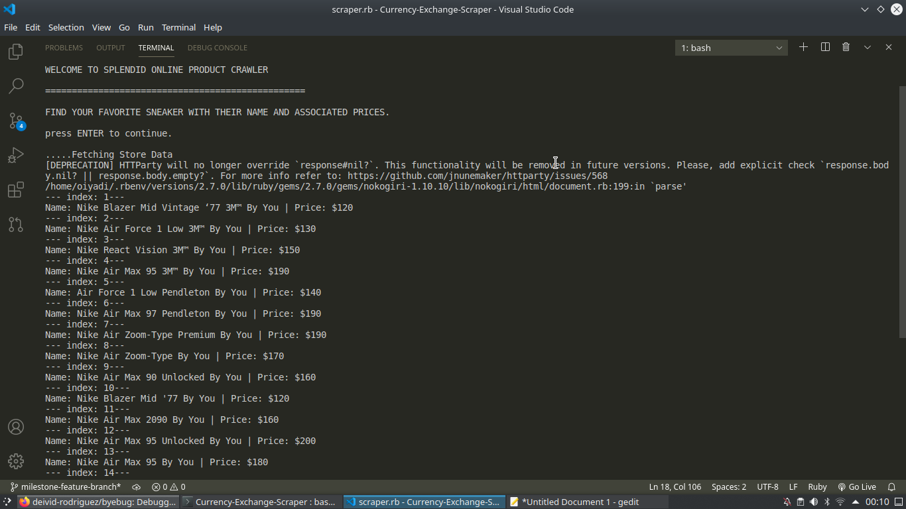

# Splendid-Product-Scraper
## A CLI-Program for getting information about Currency Exchange Rates to Euro

> This project is about building a Web crawler Program that extracts Products and their Prices from a web page and presents it to a user via the Command-line interface. A user gets to see different product (Sneakers) with prices as seen on the official page of [Nike.com](http://store.nike.com/us/en_us/pw/mens-nikeid-lifestyle-shoes/1k9Z7puZoneZoi3). [Read this to learn more about what a web crawler is.](https://en.wikipedia.org/wiki/Web_crawler)



## Built With

- Ruby 2.6x
- Other tools
    - [Nokogiri](https://nokogiri.org/)
    - [Rubocop](https://github.com/rubocop-hq/rubocop)
    - [Byebug](https://github.com/deivid-rodriguez/byebug)
    - [Rspec](https://rspec.info/)

## Getting Started

To get a local copy up and running follow these simple example steps.

### Prerequisites

You need Ruby runtime inorder to have this run on your Machine

### Install

1) Install Ruby if you don't have it
2) Open the Terminal
3) Run

```sh
git clone https://github.com/CornerstoneII/Currency-Exchange-Scraper.git
```

4) Run 'cd Currency-Exchange-Scraper' to enter the main directory
5)  Run 'bundle install'


### Run Rspec

1) Open the terminal
2) Run ```cd Currency-Exchange-Scraper``` to enter main directory
3) Ensure there is network connnection
4) Run ```rspec```
5) '100% passing' tests mean you are ready to go

### Usage

1) Open the terminal
2) Run ```cd Currency-Exchange-Scraper``` to enter main directory
3) Run ```cd bin``` to enter file directory
4) Be sure you're connected to the internet
4) Run ```ruby main``` to start the Program
5) Here on you can see the COVID-19 data for every region and country


## Author

👤 **Iyadi Oluwaseun**

- Github: [@CornerstoneII](https://github.com/CornerstoneII)
- Linkedin: [CornerstoneII](https://www.linkedin.com/in/oluwaseun-iyadi-773584b4/)


## 🤝 Contributing

Contributions, issues and feature requests are welcome!

Feel free to check the [issues page](issues/).

## Show your support

Give a ⭐️ if you like this project!

## Acknowledgments

- Microverse for showing the way for this project to happen
- The Odin Project.
